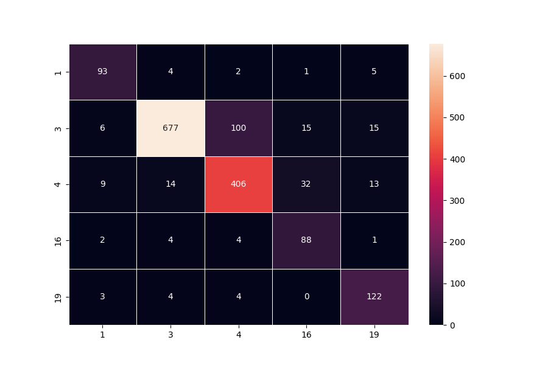

# Reuters Sentiment Analysis

In this project, we perform several Supervised Learning Algorithms to classify Reuters articles to subject categories.

Using the Reuters newswire classification dataset, we firstly extract 3 types of features. We calculate tfidf features, pre-trained sentence embeddings and we also construct a network of word emdeddings, follwed by 1D-CNN. 
The first two types of features, which produce panel data are fed to Random Forest Classifier, whereas the sequential embeddings dataset is fed to 1D CNN.

## Dependencies
* Install anaconda3

* Activate virtual enviroment
```angular2
sudo pip install --upgrade virtualenv
mkdir venvs
virtualenv my_venv
source my_venv/bin/activate
```

* Install python libraries
```angular2
pip install -r requirements.txt
```


## Processes


####  Run preprocessing (`src/preprocessing.py`)
This script reads Reuters dataset, and creates train and test data to be used for all model variations. In order to deal with imbalnce problem on train data, we only include classes that have at least 400 records (only 5 classes in total), and finally we undersample majority class, having 400 records for each class in train dataset.
```js
cd src/
python  preprocessing.py
```
#### Run tfidf feature extraction (`src/get_tfidf_features.py`)
This script takes as input the aforementioned train-test data, and extract and store tfidf features.
```js
cd src/
python3 get_tfidf_features.py
```

#### Run sentence embeddings feature extraction (`src/get_sentence_embeddings.py`)
This script takes as input the aforementioned train-test data, and extract and store senetence embedding features, based on pre-train google/universal-sentence-encoder.
```js
cd src/
python3 get_sentence_embeddings.py
```

## Evaluation

###  TFIDF-based model evaluation (`src/evaluate_tfidf_model.py`)
This script reads train-test dataset with tfidf features, trains a Random Forest based on train data and predicts test data, and finally displays several results.
```js
cd src/
python  evaluate_tfidf_model.py
```

##### TFIDF Confusion Matrix on Test data prediction



###  Senetence-Embeddings-based model evaluation (`src/evaluate_sentence_embeddings.py`)
This script reads train-test dataset with sentence embeddings features, trains a Random Forest based on train data and predicts test data, and finally displays several results.

```js
cd src/
python  evaluate_sentence_embeddings.py
```

##### TFIDF Confusion Matrix on Test data prediction


###  Sequential-Embeddings-based model evaluation (`src/evaluate_sequential_embeddings_model.py.py`)
Here, each index-word, is used as input, which is connected to an Embedding layer, followed by 1D CNN layer.
In that sense, our input data is the whole sequence of words.
Finally, we train a CNN based on train data and predict test data, and finally display several results.

```js
cd src/
python  evaluate_sequential_embeddings_model.py
```

##### TFIDF Confusion Matrix on Test data prediction


### All Results

|          | TFIDF | Sentence Emb | Sequential Emb |
|----------|-------|--------------|-------|
| Matthews corrcoef    | 0.78  | 0.67         | 0.85  |
| Accuracy | 0.85  | 0.77         | 0.90  |
